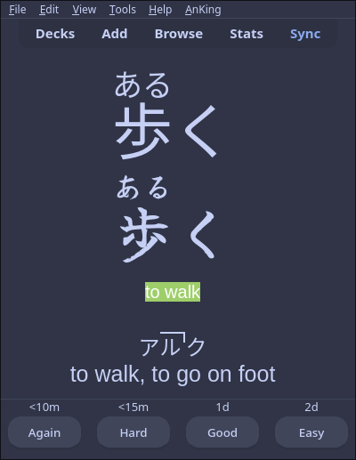
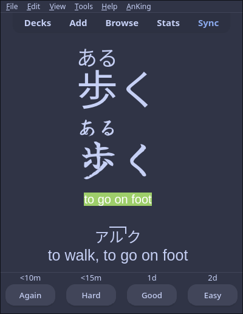
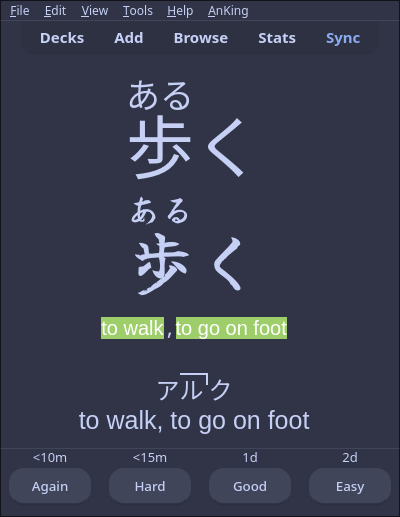
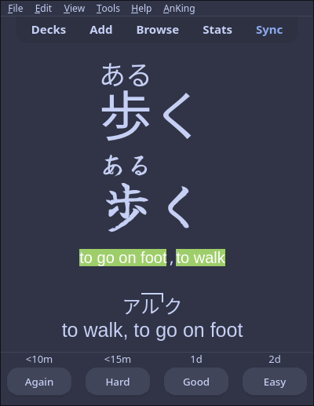
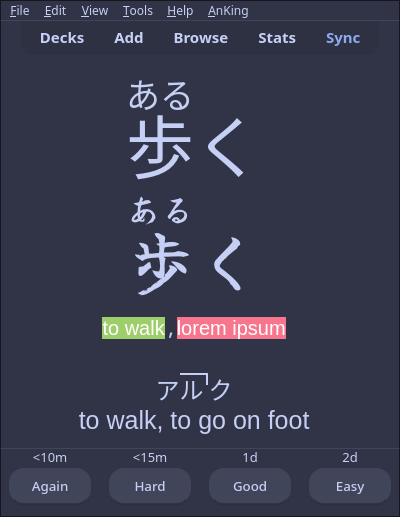

## What is the purpose of this
If you have a deck with multiple answers and you want a flexible answer, you can try this template.
In language learning, for instance. Let's take 気持ち, which can mean "feeling" or "sensation" (according to the kaishi 1.5k deck).
With this template, you can type "feeling", "sensation", or "feeling, sensation"(or in the opposite order)

